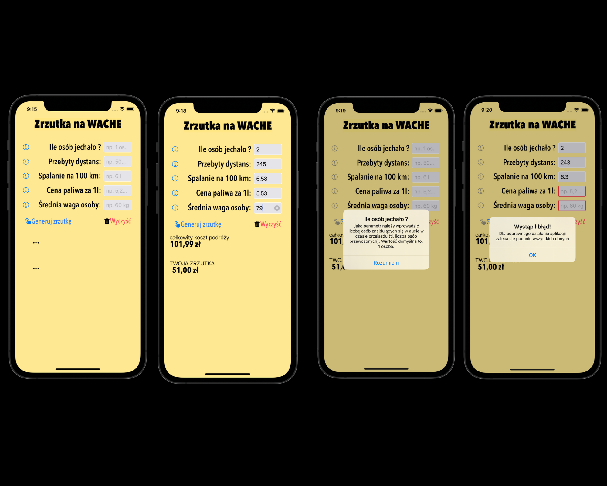

# Xamarin.iOS project called "Zrzuta na WACHE"
The project is the first one I have developed and pushed on GitHub 🔥. This simple app make it's possible for people to calculate the cost of traveling by car based on: 
- how many people are in the car,
- distance,
- fuel cost,
- milage value,
- average person weight. 

## Contents
* [General Information](#general-information)
* [Technologies Used](#technologies-used)
* [Features](#features)
* [Screenshots](#sample-screenshots)
* [Acknowledgements](#acknowledgements)

## General information
- Calculating estimated full cost of the car trip
- Possibility of sharing estimated cost between other people within the car (whip-round)
- Application layout was build for iPhone 12 iOS 14.5
- The language used in this modest application is Polish

## Technologies Used
- Xamarin.iOS 
- Interface builder
- Objective-C
- C#

## Features
List the ready (for now) features:
- Placeholders in every input text field inform what user should write in
- Info buttons next to each label show (after click) some specific info about input text 
- "Generating results" button prints counted results
- "Clean" button cleans inputted values

To do in the future:
- "Share" button to directly send a text message about whip-round back

## Sample screenshots

## Acknowledgements 
- This project was inspired by https://kalkulator-paliwa.pl 
